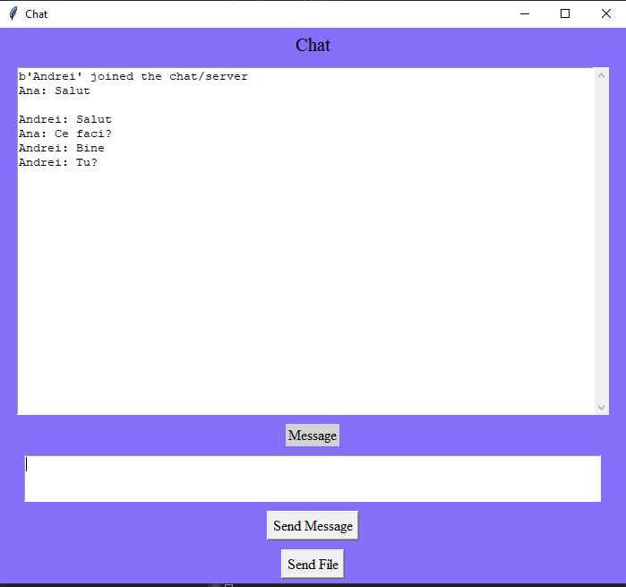

# *Lab 2 PR Malii Antonela FAF-192*
(40%)
## Laboratory work requirements
You have to develop web service which has to implement inter protocol communication.
Your main goal is to develop web service which implements communication using as much protocols as possible.

## Introducion
In this laboratory work it is implemented a chat service which will be able to handle multiple types of network connections.

## Results

## Author: 

__Malîi Antonela FAF-192__