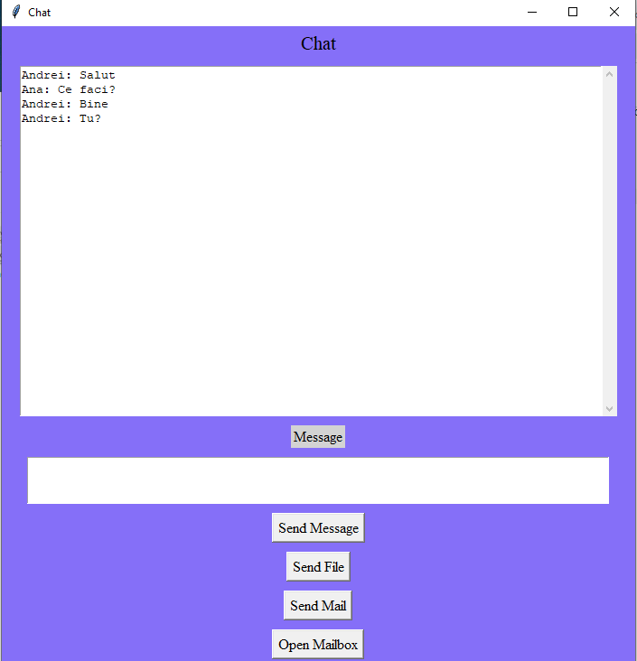
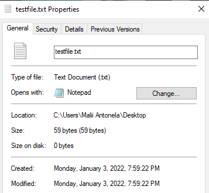
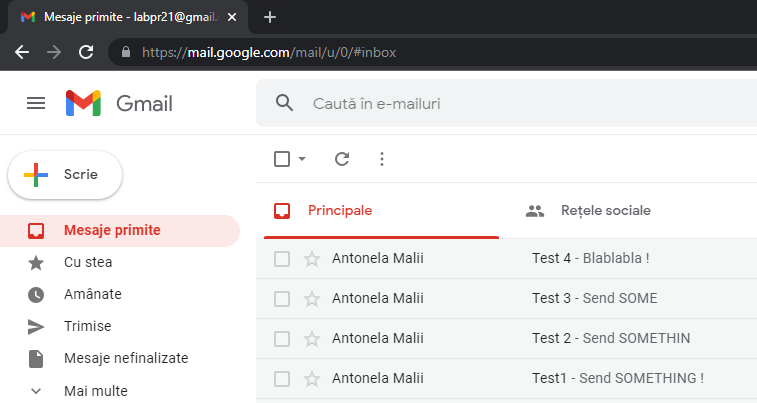
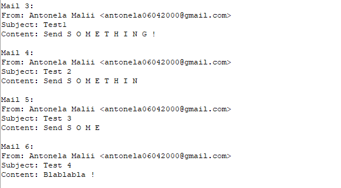
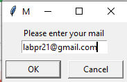
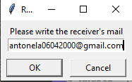
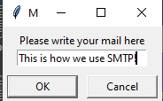

# *Lab 2 PR Malii Antonela FAF-192*
(100%)
## Laboratory work requirements
You have to develop web service which has to implement inter protocol communication.
Your main goal is to develop web service which implements communication using as much protocols as possible.

## Introducion
In this laboratory work it is implemented a chat service which will be able to handle multiple types of network connections.
Protocols:

__*1.Web Socket*__

First, it was build a server and a client using the library *socket* . As we know web socket is an application layer protocol that allows two-way communication between a client and a server.
This was done using the following chuncks of code:

Create an INET, STREAMing socket one in the server.py file and one in the main class Client from the client.py file.
```
server = socket.socket(socket.AF_INET, socket.SOCK_STREAM)
server.bind((HOST, PORT))
server.listen()

...

class Client:

    def __init__(self, host, port, hostname, user, password):

        self.sock = socket.socket(socket.AF_INET, socket.SOCK_STREAM)
        self.sock.connect((host, port))
```
And then use the socket to send and receive messages.
```
client.py
#send a message
 def send_message(self, message):
        self.sock.send(message.encode('utf-8'))
        self.input_area.delete('1.0', 'end')
#receive one
 def receive(self):
        while True:
            try:
                message = self.sock.recv(1024).decode('utf-8')
                if message == 'NICK':
                    self.sock.send(self.nickname.encode('utf-8'))
                    ...
 
 server.py                   
 def reveive():
    while True:
        client, address = server.accept()
        print(f"Connected with {str(address)}")

        client.send("NICK".encode('utf-8'))
        nickname = client.recv(1024)
        
 
 def handle(client):
    while True:
        try:
            message = client.recv(1024)
            # lock the message
            print(f"{nicknames[clients.index(client)]} says {message}")
            broadcast(message)
            
 
# and using broadcast send message to all connected clients.
def broadcast(message):
    for client in clients:
        client.send(message)
```


__*2.FTP*__

File Transmission Protocol - communication protocol used to transfer and exchange files.
The implementation of this protocol enables a client to send a random file to another client after clicking the Send File Button and this file will be downloaded locally to the receiver.

```
    def upload_file(self):
        filename = filedialog.askopenfilename().replace('/', "\\")
        name_file = filename.split('\\')[-1]

        # read file in binary mode
        with open(filename, "rb") as file:
            self.ftp_server.storbinary(f"STOR {name_file}", file)
        self.send_message(f"{self.nickname} sent file: {name_file} ")

        with open(filename, "wb") as file:
            # command for downloading the file
            self.ftp_server.retrbinary(f"RETR {name_file}", file.write)

```


__*3.IMAP*__

Internet Message Access Protocol(IMAP) -  is used to receive emails from a server. IMAP settings have the option of storing emails on the mail server. 
In this lab IMAP is used to access the emails from the inbox of labpr21@gmail.com. 
```
 def open_mail(self):
        ...

        # open our connection to gmail
        # IMAP4_SSL is a subclass derived from IMAP4 that connects over an SSL encrypted socket
        mail = imaplib.IMAP4_SSL("imap.gmail.com")
        # login
        mail.login(self.mail, self.mail_pass)
        mesaj = self.nickname + ' logged in successful into the mail ' + self.mail
        print(mesaj)
        # choose the "inbox"
        mail.select('inbox')

        ...
        
```




__*4.SMTP*__

Simple Mail Transfer Protocol is a protocol used to transfer emails from one user to another.
The function responsible of transmitting the mail from one client to another:
```
 def send_mail(self):
        # get the receiver gmail
        receiver = simpledialog.askstring("Receiver", "Please write the receiver's mail", parent=self.msg)
        # get the message
        message = simpledialog.askstring("Message", "Please write your mail here", parent=self.msg)
        # connect to the server address with port 587
        server = smtplib.SMTP('smtp.gmail.com', 587)
        # start the connection
        server.starttls()
        # login into the server
        server.login(self.mail, self.mail_pass)
        mesaj = self.nickname + ' logged in successful into the mail ' + self.mail
        print(mesaj)
        # send the email
        server.sendmail(self.mail, receiver, message)
        msg1 = '\n' + self.nickname + ' sent an email to ' + receiver + '\n'
        self.send_message(msg1)


```





## Author: 

__Malîi Antonela FAF-192__